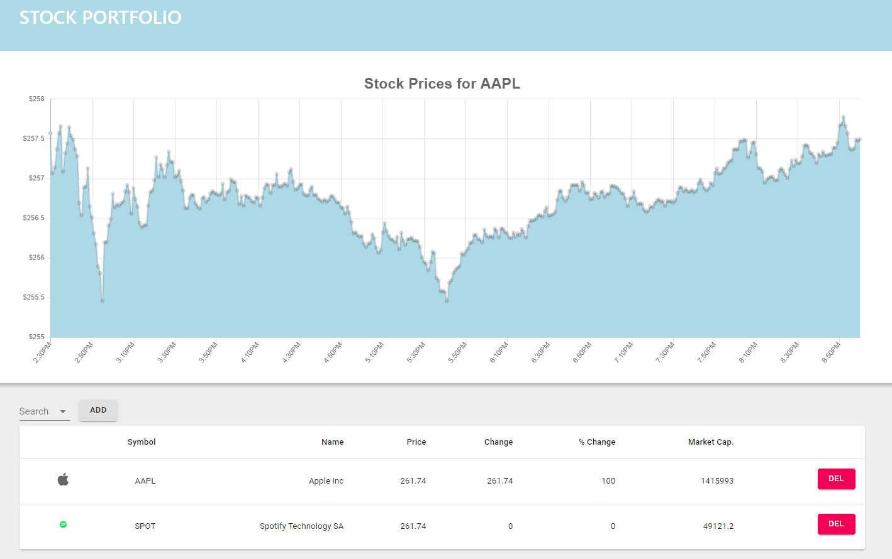
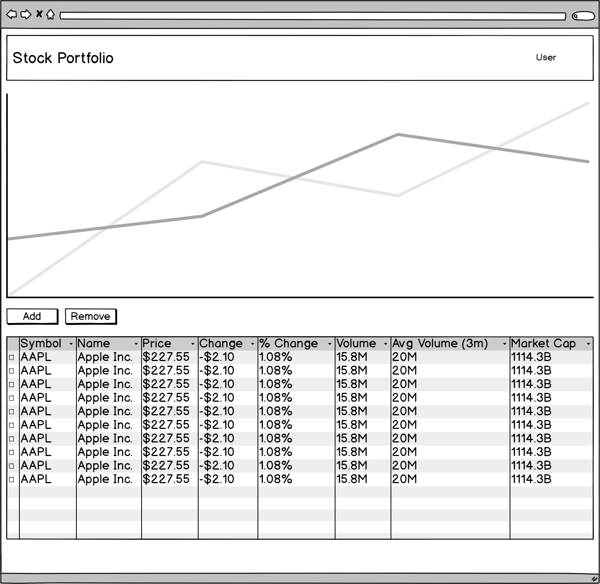

# Stock Market Portfolio

## Current solution

The current solution is built using `React` and `Redux`. The chart library is `chart.js` with a React wrapper using `react-chartjs-2`. The components are built using `material-ui` and the JSON data is emulating data expected to be requested from a third party RESTful API provided by [Finnhub](https://finnhub.io/).

## What was the problem I was trying to solve?

After finally shipping an initial release for my last project, a React component library called [Neu UI](https://ui-neu.netlify.app/), I wanted to try and complete a project that focused on delivering new functionality including:

- consuming third party RESTful APIs
- displaying complex data using charts
- familiarising myself with other component libraries

I had used other stock portfolios like eToro before but felt that there was a huge amount of added complexity to these platforms that could quite easily feel overwhelming for an amateaur user. So I wanted to create a very simple dashboard that enabled a user to select and curate a portfolio of stocks that they want to watch and analyse that stocks performance over a particular time interval.

## Specs for MVP

Stage 1 - Public Facing Dashboard

Frontend dashboard displaying sample information providing by JSON data.
- Home page
    - candle and line chart displaying stock prices for selected stock
    - inputs enabling user to pick which chart and time interval to display, e.g. day, week, month, year
    - table displaying users stock portfolio including data on price, change, % change et al
    -  input enabling user to search and add US stock to their portfolio
    - button enabling user to remove stock from portfolio

Stage 2 - RESTful API

Backend with requests made to third party RESTful API and API endpoints to connect with frontend. Needed to circumvent CORS.
- API functionality required:
    - GET chart data
    - GET stock symbol data
    - GET stock pricing data
    - GET stock financial data

Stage 3 - User / Administrator Features

- User Account and Authentication feature that allows for:
    - account creation
    - login
    - verify email
    - modify account information
    - reset password via email

## Wireframe

## To do...

- document API endpoints
- redux actions and design

## Version 2.0.

- implement webhooks for real time stock updates

**Built with <3 using React, Redux and Chart.js.**
